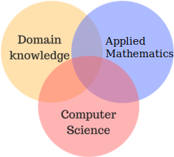

  <a href=" https://github.com/mccurcio/">
    
  <h2 align="center">Data Science Practitioner's Reading List</h2>

  

  <em>"the no-bs approach"</em>

**Greetings,** This list is compiled by [Matthew Curcio](https://mccurcio.github.io/). This list includes material that I have *used and would recommend*. Whenever possible, I prefer to list **FREE** material. 

:star: - indicates personal favorites

--------------------------------------------------------------------------

# First Steps

- Coming Soon - Article on How/Where to start.

## Great Intro Materials.

- :star: [Free Code Camp](https://www.freecodecamp.org/news/about/) FREE

-  **Learn Git!**
    - *I like to use GitHub as my software storage bank.* 
    - Git and what you put on your GitHub account **IS** your new business card.
    - [GitHub.com](https://github.com/) is by far the most common storage version control system. FREE
    - Want to try [Github's](https://guides.github.com/activities/hello-world/) tutorial.
    - You may also try [Gitlab](https://about.gitlab.com/) and [Bitbucket](https://bitbucket.org/) (Both have FREE options).
    
- :star: [R Programming for Data Science](https://bookdown.org/rdpeng/rprogdatascience/) - A GREAT Starter book for easing one into R & Data Science. *FREE Book Online* 📗

- :star: [Exploratory Data Analysis with R](http://leanpub.com/exdata) - Roger Peng has some great material too!

## Books :books:

### Mathematics

#### General Statistics

- :star: Using R for Data Management, Statistical Analysis, and Graphics by N. Horton, et al

- [Introduction to Statistical Thought](https://people.math.umass.edu/~lavine/Book/book.pdf) By Michael Lavine FREE

#### Advanced Applied Math

- :star: [Elements of Statistical Learning: Data Mining, Inference, and Prediction](https://web.stanford.edu/~hastie/ElemStatLearn/), Hastie, Tibshirani, Friedman, 2017 FREE

- :star: [Introduction to Statistical Learning with Applications in R](https://faculty.marshall.usc.edu/gareth-james/ISL/) FREE

- [Applied Generalized Linear Models and Multilevel Models in R](https://bookdown.org/roback/bookdown-BeyondMLR/), *FREE Book Online* 📗

#### Linear Algebra

- [Linear Algebra
As an Introduction to Abstract Mathematics](https://www.math.ucdavis.edu/~anne/linear_algebra/mat67_course_notes.pdf) FREE

- [A First Course in Linear Algebra, Robert A. Beezer](http://linear.ups.edu/download/fcla-3.40-tablet.pdf) FREE

- [Linear Algebra, Jim Hefferon](https://open.umn.edu/opentextbooks/textbooks/24) FREE

### Programming Information :floppy_disk:

- [Free Code Camp](https://www.freecodecamp.org/news/about/) FREE

- [GoalKicker.com](https://goalkicker.com/) FREE - Programming Books
    - **BASH, Python, MySQL, GIT, Linux**, ... 
    - **Love these**; they are more like terse notes for a quick reference.

- [Syncfusion Ebooks](https://www.syncfusion.com/ebooks), The Succinctly Series, FREE Resource
   - The **Succinctly Series** has great topics and different languages!

### Data Visualization

- Slack Group and Website: [Data Visualization Society](https://www.datavisualizationsociety.com/)

- [Mastering Shiny](https://mastering-shiny.org/) - is an online book on using R to produce an interactive graphic or dashboard.

### R-cran

- :star: [The caret Package by Max Kuhn](https://topepo.github.io/caret/index.html),  FREE Book Online* 📗
  
- [R Succinctly](https://www.syncfusion.com/succinctly-free-ebooks/rsuccinctly/getting-started-with-r) by Syncfusion FREE

- [Advanced R](https://adv-r.hadley.nz/index.html),  FREE Book Online 📗

- [blogdown: Creating Websites with R Markdown by Yihui Xie, et al](https://bookdown.org/),  FREE Book Online 📗

- [bookdown: Authoring Books and Technical Documents with R Markdown by Yihui Xie, et al](https://bookdown.org/),  FREE Book Online 📗

- [R Graphics Cookbook, 2nd edition](https://r-graphics.org/),  FREE Book Online 📗

- [A ModernDive into R and the Tidyverse](https://moderndive.com/),  FREE Book Online 📗

- [Text Mining with R](https://www.tidytextmining.com/),  FREE Book Online* 📗

### Python :snake:
  
- :star: I enjoy Dr. Chuck's youtube lectures [Coursera Python for Everybody](https://www.coursera.org/specializations/python) 5 course series provided by [Dr Charles Severance](http://www.dr-chuck.com/), FREE Book Online 📗

- :star: [Python Data Science Handbook](https://jakevdp.github.io/PythonDataScienceHandbook/) By Jake VanderPlas

- However there are so many alternatives

- [Learn X in Y minutes, X = Python](https://learnxinyminutes.com/docs/python/)
  
- [Sthurlow.com](http://sthurlow.com/python/lesson01/)
  
- [IPython Interactive Computing](https://ipython.org/books.html)
  
- [Intermediate Python](https://book.pythontips.com/en/latest/args_and_kwargs.html)
  
- [Cosmicpython](https://www.cosmicpython.com/#buy_the_book)

### Bash :goat:

- :star: [Data Science at the Command Line by Jeroen Janssens](https://datascienceatthecommandline.com/2e/),   FREE Book Online 📗
  
### SQL - Under Construction

- [PostgreSQL Notes for Professionals](https://goalkicker.com/) :Free: Goalkicker has many books. Although I call them reference type materiale.
  
### Markdown :arrow_down_small:

- :star: [R Markdown: The Definitive Guide by Yihui Xie, et al](https://bookdown.org/),   FREE Book Online 📗

- :star: [R Markdown Cookbook](https://bookdown.org/yihui/rmarkdown-cookbook/) Needed if you are going to use .RMD notebooks and docs.   FREE Book Online 📗
- 
- For a full list of available Github markdown emoji and codes, check out [emoji-cheat-sheet](https://www.webfx.com/tools/emoji-cheat-sheet/).
   
### Linux :penguin:

- :star: [Just Enough Linux, Malcolm Maclean](https://leanpub.com/jelinux) FREE

### Machine Learning :tractor:

- :star: [Applied Predictive Modeling by Max Kuhn, K Johnson](http://appliedpredictivemodeling.com/)

- [Hands-On Machine Learning with R by Bradley Boehmke, et al](https://bradleyboehmke.github.io/HOML/)  FREE

- [Introduction to Data Science: Data Analysis and Prediction Algorithms with R by Rafael Irizarry](https://rafalab.github.io/dsbook/)   FREE

- :star: A [Course in Machine Learning](http://ciml.info/dl/v0_9/ciml-v0_9-all.pdf) by [Hal Daumé III](https://users.umiacs.umd.edu/~hal/) This is a **great illustrative book** for beginners.  FREE

- :star: Machine Learning, Tom M. Mitchell, ISBN: 0070428077 Very Good

- [SciKit Learn Tutorial](http://gael-varoquaux.info/scikit-learn-tutorial/)

- [Building Machine Learning Systems with Python](http://totoharyanto.staff.ipb.ac.id/files/2012/10/Building-Machine-Learning-Systems-with-Python-Richert-Coelho.pdf) By Richert Coelho & Willi Richert  FREE

- :star: [Exploratory Data Analysis with R by Roger Peng](https://leanpub.com/exdata), FREE Book Online 📗

- [Syncfusion Ebooks](https://www.syncfusion.com/ebooks) GREAT resource! :free:
    - [Keras](https://www.syncfusion.com/ebooks/keras-succinctly) by James McCaffrey   FREE
   
- [SVM Tutorial](https://www.svm-tutorial.com/)
    
- [Pattern Recognition and Machine Learning](https://www.microsoft.com/en-us/research/uploads/prod/2006/01/Bishop-Pattern-Recognition-and-Machine-Learning-2006.pdf), Christopher Bishop, 2006, ISBN-13: 978-0387-31073-2  FREE

- Artificial Intelligence: A Modern Approach, Stuart Russell & Peter Norvig, ISBN-13: 978-0-13-604259-4

- [Foundations of Machine Learning - Ed.2018](https://cs.nyu.edu/~mohri/mlbook/) By Mehryar Mohri, et al   FREE
 
- [Pattern Recognition & Machine Learning](https://www.cs.uoi.gr/~arly/courses/ml/tmp/Bishop_book.pdf) By Christopher Bishop : **Heavy on the math**   FREE

- [Natural Language Processing with Python](https://www.nltk.org/book/) Analyzing Text with the Natural Language Toolkit. By Steven Bird, Ewan Klein, and Edward Loper, **Very Hands-on guide book**   FREE

### Information Theory

- [Information Theory, Inference, and Learning Algorithms](http://www.inference.org.uk/itprnn/book.pdf) - By David MacKay *I'm interested in reading the section on Hash codes, p.193*   FREE

### Supervised :label:

- [What are decision trees? by Carl Kingsford and Steven L Salzberg](https://www.ncbi.nlm.nih.gov/pmc/articles/PMC2701298/)

### Unsupervised :apple:

- [Unsupervised Machine Learning, Michael Foley](https://bookdown.org/mpfoley1973/unsupervised-ml/) *Book Online* 📗
 
### Semi-supervised :green_apple:
 
### Reinforcement Learning :muscle:

### Articles :page_with_curl:

- :star: [Top 10 algorithms in data mining by Xindong Wu et al](https://www.cs.umd.edu/~samir/498/10Algorithms-08.pdf) 
    I found this 2007 paper really interesting as it was my starting point. The written explanations of the ML tools are not written for beginners in mind, however I feel that it provides a look into which tools are commonly used (as of 2007) and still important overall. I might suggest pulling out the Algos and investigating them in conjunction with other literature.

## People :man_student: :woman_student:
  
- [Andrew Ng](https://www.andrewng.org/) - Dr Ng is one of the creators of Coursera, but he also has additional [machine learning content](https://www.deeplearning.ai/)

- [Geoffrey Hinton](https://www.cs.toronto.edu/~hinton/)
    - :star:[Learning representations by back-propagating errors](https://www.cs.toronto.edu/~hinton/absps/naturebp.pdf)

- [Jeff Leek](http://jtleek.com/index.html)
    - [Introduction to Cloud-Based Data Science by Jeffrey Leek](https://leanpub.com/universities/courses/jhu/cbds-intro)

- [Roger Peng](https://leanpub.com/u/rdpeng)

## Videos :tv:

- [FreeCodeCamp](https://www.freecodecamp.org/) **FCC** has a ton of video lectures on Youtube and which are available thru their own site. The community is welcoming, too.

- :star: [Victor Lavrenko](https://www.youtube.com/channel/UCs7alOMRnxhzfKAJ4JjZ7Wg) High quality videos from his lectures. One of my Favorites.

- :star: [Artifical Intelligences, MIT 6.034, w/ Patrick Winston](https://ocw.mit.edu/courses/electrical-engineering-and-computer-science/6-034-artificial-intelligence-fall-2010/lecture-videos/)  One of my Favorites.

- :star: [3Blue1Brown](https://www.youtube.com/channel/UCYO_jab_esuFRV4b17AJtAw/featured) is produced by Grant Sanderson and has GREAT animations.

- :star: [Dr. Bharatendra Rai](https://www.youtube.com/channel/UCuWECsa_za4gm7B3TLgeV_A) from Umass, Dartmouth. His videos are very professsional and filled with highly relevant code. Dr Rai's videos are very clear and methodical.

- :star: [StatQuest with Josh Starmer](https://www.youtube.com/channel/UCtYLUTtgS3k1Fg4y5tAhLbw) Dr Starmer now teaches at NC state.  Josh has recently been broadcasting LIVE to boot. **BAM!**

- The [MathematicalMonk](https://www.youtube.com/channel/UCcAtD_VYwcYwVbTdvArsm7w)

## Miscellaneous

- :star: [Calibre](https://calibre-ebook.com/) This program is Excellent for organizing PDF's, Epubs and mobi book and article formats. My **favorite book and pdf cataloging software** :free:

- :warning: [100+ Free Data Science Books](https://www.learndatasci.com/free-data-science-books/) Outdated list of books but worth a few minutes. :free:

- :star: [LeanPub](https://leanpub.com/) is a great resource for computer related books. Many books are pay what you want. They have books by Roger Peng and Jeff Leek who have written books on D.S.

[Back to top ↑](#data-Science-Practitioner's-Reading-List)
  
  
---
  
## Online Courses:

- :star: [Python for Everybody, 'Py4E'](https://www.freecodecamp.org/) I enjoy Dr. Chuck's youtube lectures. This is a 5 course series provided by [Dr Charles Severance](http://www.dr-chuck.com/), FREE Course follows his FREE Book Online 📗

